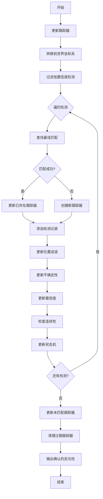
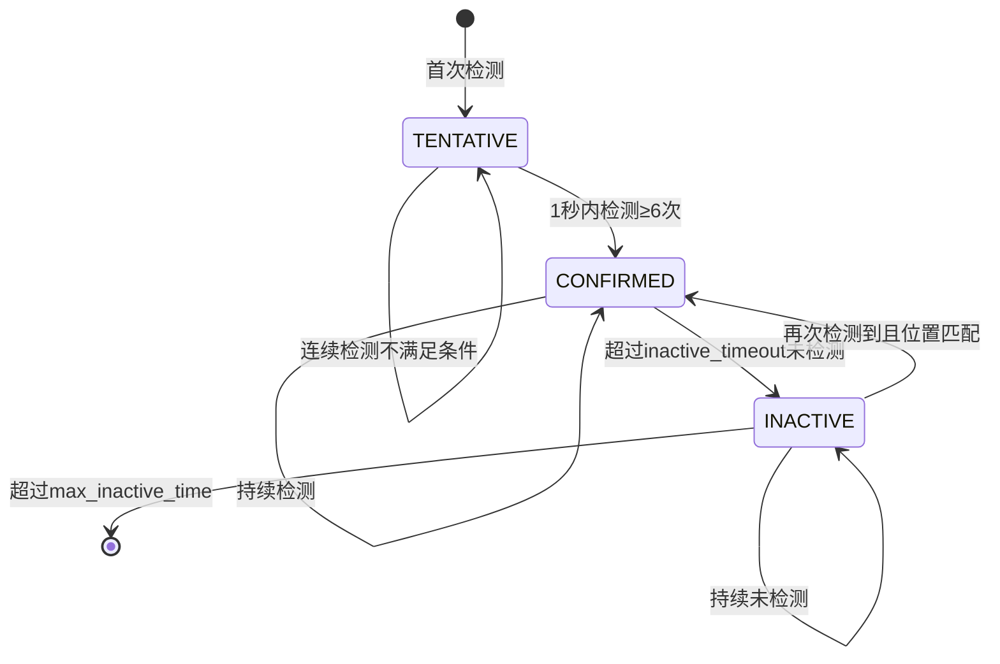

# 全局反光柱位置跟踪器 (Global Reflector Tracker)

## 目录
- [概述](#概述)
- [设计目标](#设计目标)
- [核心概念](#核心概念)
- [数据结构](#数据结构)
- [算法设计](#算法设计)
- [状态机](#状态机)
- [配置参数](#配置参数)
- [集成指南](#集成指南)
- [可视化](#可视化)
- [性能优化](#性能优化)

## 概述

全局反光柱位置跟踪器是一个用于管理反光柱全局ID、过滤噪声检测、保持位置一致性的系统。它通过连续性检测、位置滤波和状态机管理，确保只有真实的反光柱才能获得持久化的全局ID。

### 主要功能

1. **ID持久化**：已确认的反光柱ID永久保留，即使长时间未检测到
2. **噪声过滤**：基于滑动窗口的连续性检测，过滤随机噪声
3. **位置平滑**：使用EMA滤波和不确定性估计，提供准确的位置估计
4. **快速重匹配**：INACTIVE状态的反光柱仍参与匹配，返回原区域时快速恢复ID
5. **置信度计算**：综合检测质量、位置不确定性和连续性计算置信度

## 设计目标

### 1. ID唯一性与持久性
- 每个真实的反光柱拥有唯一的全局ID
- ID一旦分配，永久保留（除非手动重置）
- 即使长时间未检测到，ID也不会被重新分配

### 2. 噪声过滤
- 过滤随机出现的误检测
- 通过连续性检测区分真实反光柱和噪声
- 噪声无法在短时间内形成连续检测

### 3. 位置准确性
- 使用EMA滤波平滑位置抖动
- 估计位置不确定性（标准差）
- 自适应调整滤波参数

### 4. 状态管理
- 清晰的状态机设计
- TENTATIVE（待确认）→ CONFIRMED（已确认）→ INACTIVE（未激活）
- 状态转换基于明确的规则

## 核心概念

### 1. 连续性检测

**原理**：真实的反光柱能够在短时间内被连续检测到，而噪声则表现出随机性和不稳定性。

**实现方式**：使用滑动窗口统计检测次数
- 时间窗口：1秒
- 最小检测次数：6次
- 只有满足条件的反光柱才能确认为真实反光柱

**优势**：
- 有效过滤随机噪声
- 避免基于累计检测次数的错误确认
- 对检测频率不敏感，只关注连续性

### 2. 位置滤波（EMA）

**原理**：使用指数移动平均（Exponential Moving Average）平滑位置估计。

**公式**：
```
filtered_position = α * measured_position + (1 - α) * previous_filtered_position
```

**参数**：
- α = 0.3：30%权重给新测量，70%权重给历史估计
- 较小的α值提供更强的平滑效果，但响应较慢

### 3. 不确定性估计

**原理**：估计位置测量的不确定性，用于置信度计算和匹配阈值调整。

**实现**：
- 计算测量误差的EMA方差
- 标准差 = √方差
- 限制标准差范围：[0.02m, 0.5m]

**用途**：
- 调整匹配阈值：CONFIRMED状态的反光柱匹配阈值 = 基础阈值 + 2×标准差
- 置信度计算：不确定性越大，置信度越低
- 异常检测：标准差超过阈值标记为异常

### 4. 置信度计算

**综合因素**：
1. **检测质量**：基于圆拟合误差、内点比例等
2. **位置不确定性**：标准差越小，置信度越高
3. **连续性检测**：满足连续性条件提升置信度

**公式**：
```
adjusted_confidence = avg_confidence * (1 - 0.3 * uncertainty_penalty)
if (checkContinuity) {
    adjusted_confidence = min(1.0, adjusted_confidence + 0.2)
}
```

## 数据结构

### TrackedReflector

```cpp
struct TrackedReflector {
    // === 基本信息 ===
    int global_id;                          // 永久全局ID
    Point global_position;                  // 世界坐标系位置（最新检测）
    Point filtered_position;                // EMA滤波后的位置
    DetectedReflector latest_detection;     // 最新检测数据
    
    // === 状态管理 ===
    enum State {
        TENTATIVE,  // 待确认：刚创建，等待连续性验证
        CONFIRMED,  // 已确认：通过连续性检测，ID永久保留
        INACTIVE    // 未激活：长时间未检测，但ID保留
    } state;
    
    // === 连续性检测（滑动窗口）===
    struct DetectionRecord {
        double timestamp;                   // 检测时间戳
        Point position;                     // 检测位置
        double confidence;                   // 检测置信度
    };
    std::deque<DetectionRecord> detection_history;  // 滑动窗口内的检测记录
    
    // === 位置滤波与不确定性 ===
    double position_std_dev;                // 位置标准差（不确定性估计）
    double position_variance;               // 位置方差（用于计算std_dev）
    double avg_confidence;                  // 平均置信度
    double accumulated_confidence;          // 累积置信度（用于计算平均）
    
    // === 统计信息 ===
    int total_detection_count;              // 累计检测次数
    int consecutive_detections;             // 连续检测次数
    int consecutive_misses;                 // 连续丢失次数
    double last_detection_time;             // 最后检测时间
    double first_detection_time;            // 首次检测时间
    
    // === 几何属性 ===
    double diameter;                         // 估计直径（EMA滤波）
    double diameter_std_dev;                 // 直径标准差
    
    // === 可视化 ===
    int visualization_color_id;              // 可视化颜色ID（基于ID固定）
};
```

### GlobalReflectorTracker::Config

```cpp
struct Config {
    // 匹配参数
    double match_distance_threshold;    // 匹配距离阈值（m）
    double match_distance_inactive;     // INACTIVE状态的匹配阈值（更大）
    
    // 连续性检测参数
    double confirm_time_window;         // 确认时间窗口（s）
    int min_detections_in_window;       // 窗口内最小检测次数
    
    // 状态管理参数
    double inactive_timeout;            // 进入INACTIVE状态的超时时间（s）
    double max_inactive_time;          // INACTIVE状态最大保留时间（s）
    
    // 位置滤波参数
    double position_filter_alpha;       // EMA滤波系数（0-1）
    double position_filter_beta;        // 方差滤波系数
    double min_std_dev;                 // 最小标准差（防止过拟合）
    double max_std_dev;                 // 最大标准差（异常检测）
    
    // 置信度参数
    double min_confidence_to_track;     // 最小置信度才跟踪
    double confidence_filter_alpha;     // 置信度EMA滤波系数
    
    // 直径滤波参数
    double diameter_filter_alpha;       // 直径EMA滤波系数
};
```

## 算法设计

### 1. 主更新流程



### 2. 位置滤波算法

```cpp
void updatePositionFilter(TrackedReflector& tracker, const Point& measured_position) {
    double alpha = config_.position_filter_alpha;
    
    // EMA位置滤波
    tracker.filtered_position.x = alpha * measured_position.x + 
                                  (1 - alpha) * tracker.filtered_position.x;
    tracker.filtered_position.y = alpha * measured_position.y + 
                                  (1 - alpha) * tracker.filtered_position.y;
    
    // 更新不确定性估计
    updatePositionUncertainty(tracker, measured_position);
    
    // 直径滤波
    tracker.diameter = config_.diameter_filter_alpha * tracker.latest_detection.diameter +
                      (1 - config_.diameter_filter_alpha) * tracker.diameter;
}
```

### 3. 不确定性估计

```cpp
void updatePositionUncertainty(TrackedReflector& tracker, const Point& measured_position) {
    // 计算测量误差
    double dx = measured_position.x - tracker.filtered_position.x;
    double dy = measured_position.y - tracker.filtered_position.y;
    double squared_error = dx * dx + dy * dy;
    
    if (tracker.total_detection_count == 1) {
        // 第一次检测：初始化方差
        tracker.position_variance = squared_error;
    } else {
        // EMA方差更新
        double beta = config_.position_filter_beta;
        tracker.position_variance = beta * squared_error + 
                                    (1 - beta) * tracker.position_variance;
    }
    
    // 计算标准差
    tracker.position_std_dev = std::sqrt(tracker.position_variance);
    
    // 限制标准差范围
    tracker.position_std_dev = std::max(config_.min_std_dev, 
                                        std::min(config_.max_std_dev, 
                                               tracker.position_std_dev));
}
```

### 4. 连续性检测

```cpp
bool checkContinuity(const TrackedReflector& tracker) const {
    // 移除时间窗口外的检测记录
    double window_start = current_timestamp_ - config_.confirm_time_window;
    
    while (!tracker.detection_history.empty() && 
           tracker.detection_history.front().timestamp < window_start) {
        tracker.detection_history.pop_front();
    }
    
    // 检查窗口内的检测次数
    size_t detections_in_window = tracker.detection_history.size();
    
    if (detections_in_window >= static_cast<size_t>(config_.min_detections_in_window)) {
        return true;
    }
    
    return false;
}
```

### 5. 匹配算法

```cpp
MatchResult findBestMatch(const Point& global_position, 
                        const std::vector<TrackedReflector>& tracked_reflectors,
                        bool include_inactive) const {
    MatchResult result;
    result.tracker_id = -1;
    result.distance = std::numeric_limits<double>::max();
    
    for (size_t i = 0; i < tracked_reflectors.size(); ++i) {
        const auto& tracker = tracked_reflectors[i];
        
        // 跳过INACTIVE状态（如果不包括）
        if (!include_inactive && tracker.state == TrackedReflector::INACTIVE) {
            continue;
        }
        
        // 计算匹配距离（考虑不确定性）
        double distance = global_position.distanceTo(tracker.filtered_position);
        
        // 根据状态使用不同的匹配阈值
        double threshold = config_.match_distance_threshold;
        if (tracker.state == TrackedReflector::INACTIVE) {
            threshold = config_.match_distance_inactive;
        } else if (tracker.state == TrackedReflector::CONFIRMED) {
            // CONFIRMED状态考虑位置不确定性
            threshold += tracker.position_std_dev * 2.0;
        }
        
        if (distance < threshold && distance < result.distance) {
            result.tracker_id = i;
            result.distance = distance;
        }
    }
    
    return result;
}
```

## 状态机

### 状态转换图



### 状态定义

| 状态 | 描述 | 行为 |
|------|------|------|
| **TENTATIVE** | 刚创建，等待连续性验证 | 收集检测记录，检查是否满足连续性条件 |
| **CONFIRMED** | 已确认，ID永久保留 | 持续更新位置和置信度，监控是否进入INACTIVE |
| **INACTIVE** | 未激活，但ID保留 | 仍参与匹配，重新检测后快速恢复CONFIRMED状态 |

### 状态转换规则

#### TENTATIVE → CONFIRMED
- **条件**：滑动窗口内检测次数 ≥ min_detections_in_window
- **动作**：状态改为CONFIRMED，输出确认信息

#### CONFIRMED → INACTIVE
- **条件**：当前时间 - 最后检测时间 > inactive_timeout
- **动作**：状态改为INACTIVE，输出警告信息

#### INACTIVE → CONFIRMED
- **条件**：当前时间 - 最后检测时间 ≤ inactive_timeout
- **动作**：状态改为CONFIRMED，输出恢复信息

#### INACTIVE → 删除
- **条件**：当前时间 - 最后检测时间 > max_inactive_time
- **动作**：从跟踪列表中移除

### 状态更新算法

```cpp
void updateState(TrackedReflector& tracker, double current_time) {
    double time_since_last_detection = current_time - tracker.last_detection_time;
    
    switch (tracker.state) {
        case TrackedReflector::TENTATIVE:
            // 检查是否满足连续性条件
            if (checkContinuity(tracker)) {
                tracker.state = TrackedReflector::CONFIRMED;
                RCLCPP_INFO(logger_, "✓ 反光柱 %d 确认为真实反光柱 (检测次数: %zu)", 
                           tracker.global_id, tracker.detection_history.size());
            }
            // 如果长时间未检测，重置
            else if (time_since_last_detection > config_.confirm_time_window * 2) {
                tracker.detection_history.clear();
                tracker.consecutive_misses = 0;
            }
            break;
            
        case TrackedReflector::CONFIRMED:
            // 检查是否进入INACTIVE状态
            if (time_since_last_detection > config_.inactive_timeout) {
                tracker.state = TrackedReflector::INACTIVE;
                RCLCPP_INFO(logger_, "⚠ 反光柱 %d 进入INACTIVE状态", tracker.global_id);
            }
            break;
            
        case TrackedReflector::INACTIVE:
            // 检查是否重新激活
            if (time_since_last_detection <= config_.inactive_timeout) {
                tracker.state = TrackedReflector::CONFIRMED;
                RCLCPP_INFO(logger_, "↻ 反光柱 %d 重新激活", tracker.global_id);
            }
            break;
    }
}
```

## 配置参数

### 完整配置示例

```yaml
global_tracking:
  # === 匹配参数 ===
  match_distance_threshold: 0.3        # CONFIRMED/TENTATIVE匹配阈值30cm
  match_distance_inactive: 0.5         # INACTIVE匹配阈值50cm
  
  # === 连续性检测参数 ===
  confirm_time_window: 1.0             # 确认时间窗口1秒
  min_detections_in_window: 6          # 窗口内最小检测6次
  
  # === 状态管理参数 ===
  inactive_timeout: 5.0                # 5秒未检测进入INACTIVE状态
  max_inactive_time: 60.0              # INACTIVE状态最大保留60秒
  
  # === 位置滤波参数 ===
  position_filter_alpha: 0.3           # EMA滤波系数（0.3表示30%权重给新测量）
  position_filter_beta: 0.2            # 方差滤波系数
  min_std_dev: 0.02                     # 最小标准差2cm
  max_std_dev: 0.5                      # 最大标准差50cm（异常检测）
  
  # === 置信度参数 ===
  min_confidence_to_track: 0.3         # 最小置信度才跟踪
  confidence_filter_alpha: 0.2         # 置信度EMA滤波系数
  
  # === 直径滤波参数 ===
  diameter_filter_alpha: 0.3           # 直径EMA滤波系数
```

### 参数调优建议

#### 1. 匹配距离阈值

| 场景 | 推荐值 | 说明 |
|------|--------|------|
| 高精度环境 | 0.2m | 反光柱位置稳定，检测精度高 |
| 一般环境 | 0.3m | 平衡准确性和鲁棒性 |
| 复杂环境 | 0.4m | 存在较多干扰，需要更大容差 |

#### 2. 连续性检测参数

| 场景 | time_window | min_detections | 说明 |
|------|-------------|----------------|------|
| 高频检测 | 0.5s | 4 | 检测频率高（如20Hz） |
| 中频检测 | 1.0s | 6 | 标准检测频率（如10Hz） |
| 低频检测 | 2.0s | 4 | 检测频率低（如2Hz） |

#### 3. 位置滤波参数

| 参数 | 范围 | 影响 |
|------|------|------|
| position_filter_alpha | 0.1-0.5 | 越小平滑越强，响应越慢 |
| position_filter_beta | 0.1-0.3 | 越小方差估计越稳定 |
| min_std_dev | 0.01-0.05 | 防止过拟合 |
| max_std_dev | 0.3-1.0 | 异常检测阈值 |

## 集成指南

### 1. 头文件包含

```cpp
#include "amr_reflector_noise_handling/global_reflector_tracker.hpp"
```

### 2. 初始化

```cpp
// 在ReflectorNoiseBagNode类中添加成员变量
class ReflectorNoiseBagNode : public rclcpp::Node {
private:
    GlobalReflectorTracker global_reflector_tracker_;
    
    // 在构造函数中初始化
    ReflectorNoiseBagNode() : Node("reflector_noise_bag_node") {
        // 读取配置参数
        GlobalReflectorTracker::Config config;
        config.match_distance_threshold = this->declare_parameter(
            "global_tracking.match_distance_threshold", 0.3);
        // ... 其他参数 ...
        
        global_reflector_tracker_ = GlobalReflectorTracker(config);
    }
};
```

### 3. 更新跟踪器

```cpp
void processFrame(size_t frame_index) {
    // ... 现有的检测代码 ...
    
    detectReflectors(clusters, frame->reflectors);
    
    // 更新全局跟踪器
    global_reflector_tracker_.update(
        frame->reflectors,
        frame->global_pose,  // Transform from laser to world
        rclcpp::Time(frame->timestamp).seconds()
    );
    
    // 获取确认的反光柱
    auto confirmed_reflectors = 
        global_reflector_tracker_.getConfirmedReflectors();
    
    RCLCPP_INFO(this->get_logger(), 
               "检测到 %zu 个反光柱, 跟踪确认 %zu 个",
               frame->reflectors.size(), 
               confirmed_reflectors.size());
}
```

### 4. 可视化

```cpp
void publishTrackedReflectorMarkers(
    const std::vector<TrackedReflector>& tracked_reflectors
) {
    visualization_msgs::msg::MarkerArray marker_array;
    
    for (size_t i = 0; i < tracked_reflectors.size(); ++i) {
        const auto& tracker = tracked_reflectors[i];
        
        // 创建圆柱标记
        visualization_msgs::msg::Marker cylinder_marker;
        cylinder_marker.header.stamp = this->now();
        cylinder_marker.header.frame_id = "odom";
        cylinder_marker.ns = "tracked_reflectors";
        cylinder_marker.id = tracker.global_id;
        cylinder_marker.type = visualization_msgs::msg::Marker::CYLINDER;
        cylinder_marker.action = visualization_msgs::msg::Marker::ADD;
        
        cylinder_marker.pose.position.x = tracker.filtered_position.x;
        cylinder_marker.pose.position.y = tracker.filtered_position.y;
        cylinder_marker.pose.position.z = 0.0;
        cylinder_marker.pose.orientation.w = 1.0;
        
        cylinder_marker.scale.x = tracker.diameter;
        cylinder_marker.scale.y = tracker.diameter;
        cylinder_marker.scale.z = 0.5;
        
        // 根据状态设置颜色
        switch (tracker.state) {
            case TrackedReflector::CONFIRMED:
                cylinder_marker.color.r = 0.0;
                cylinder_marker.color.g = 1.0;
                cylinder_marker.color.b = 0.0;
                cylinder_marker.color.a = 0.8;
                break;
            case TrackedReflector::TENTATIVE:
                cylinder_marker.color.r = 1.0;
                cylinder_marker.color.g = 1.0;
                cylinder_marker.color.b = 0.0;
                cylinder_marker.color.a = 0.6;
                break;
            case TrackedReflector::INACTIVE:
                cylinder_marker.color.r = 0.5;
                cylinder_marker.color.g = 0.5;
                cylinder_marker.color.b = 0.5;
                cylinder_marker.color.a = 0.3;
                break;
        }
        
        marker_array.markers.push_back(cylinder_marker);
        
        // 创建文本标记（显示ID）
        visualization_msgs::msg::Marker text_marker;
        text_marker.header.stamp = this->now();
        text_marker.header.frame_id = "odom";
        text_marker.ns = "tracked_reflectors_text";
        text_marker.id = tracker.global_id + 1000;
        text_marker.type = visualization_msgs::msg::Marker::TEXT_VIEW_FACING;
        text_marker.action = visualization_msgs::msg::Marker::ADD;
        
        text_marker.pose.position.x = tracker.filtered_position.x;
        text_marker.pose.position.y = tracker.filtered_position.y;
        text_marker.pose.position.z = 0.6;
        text_marker.pose.orientation.w = 1.0;
        
        text_marker.scale.z = 0.3;
        text_marker.color.r = 1.0;
        text_marker.color.g = 1.0;
        text_marker.color.b = 1.0;
        text_marker.color.a = 1.0;
        
        // 显示ID和状态
        std::string state_str;
        switch (tracker.state) {
            case TrackedReflector::CONFIRMED: state_str = "CONF"; break;
            case TrackedReflector::TENTATIVE: state_str = "TENT"; break;
            case TrackedReflector::INACTIVE: state_str = "INAC"; break;
        }
        text_marker.text = "ID:" + std::to_string(tracker.global_id) + 
                          " " + state_str + 
                          " (" + std::to_string(tracker.detection_history.size()) + ")";
        
        marker_array.markers.push_back(text_marker);
        
        // 创建不确定性椭圆
        visualization_msgs::msg::Marker ellipse_marker;
        ellipse_marker.header.stamp = this->now();
        ellipse_marker.header.frame_id = "odom";
        ellipse_marker.ns = "tracked_reflectors_uncertainty";
        ellipse_marker.id = tracker.global_id + 2000;
        ellipse_marker.type = visualization_msgs::msg::Marker::CYLINDER;
        ellipse_marker.action = visualization_msgs::msg::Marker::ADD;
        
        ellipse_marker.pose.position.x = tracker.filtered_position.x;
        ellipse_marker.pose.position.y = tracker.filtered_position.y;
        ellipse_marker.pose.position.z = 0.01;
        ellipse_marker.pose.orientation.w = 1.0;
        
        ellipse_marker.scale.x = tracker.position_std_dev * 2.0;
        ellipse_marker.scale.y = tracker.position_std_dev * 2.0;
        ellipse_marker.scale.z = 0.01;
        
        ellipse_marker.color.r = 0.0;
        ellipse_marker.color.g = 0.0;
        ellipse_marker.color.b = 1.0;
        ellipse_marker.color.a = 0.3;
        
        marker_array.markers.push_back(ellipse_marker);
    }
    
    tracked_marker_pub_->publish(marker_array);
}
```

## 可视化

### 标记说明

| 标记类型 | 颜色 | 说明 |
|---------|------|------|
| **CONFIRMED圆柱** | 绿色 | 已确认的反光柱 |
| **TENTATIVE圆柱** | 黄色 | 待确认的反光柱 |
| **INACTIVE圆柱** | 灰色 | 未激活的反光柱（半透明） |
| **文本标签** | 白色 | 显示ID、状态和检测次数 |
| **不确定性椭圆** | 蓝色（半透明） | 表示位置不确定性（2σ范围） |

### RViz配置

1. 添加MarkerArray显示
   - Topic: `/reflector_tracked_markers`
   - Marker Topic: `tracked_reflectors`

2. 调整显示选项
   - 启用圆柱体显示
   - 启用文本显示
   - 调整透明度以区分不同状态

### 示例输出

```
[INFO] 检测到 5 个反光柱, 跟踪确认 3 个
[INFO] ✓ 反光柱 0 确认为真实反光柱 (检测次数: 7)
[INFO] ✓ 反光柱 1 确认为真实反光柱 (检测次数: 6)
[INFO] ⚠ 反光柱 2 进入INACTIVE状态
[INFO] ↻ 反光柱 2 重新激活
```

## 性能优化

### 1. 算法复杂度

- **匹配算法**：O(n × m)，其中n是检测数量，m是跟踪器数量
- **实际场景**：n和m通常小于10，性能影响可忽略
- **优化空间**：对于大量反光柱，可使用KD树加速匹配

### 2. 内存优化

- 使用`std::deque`存储检测历史，自动管理内存
- 限制滑动窗口大小，避免无限增长
- 定期清理过期的INACTIVE跟踪器

### 3. 计算优化

- 避免重复计算：缓存常用值（如平方距离）
- 使用快速距离比较：先比较平方距离，避免sqrt
- 批量更新：减少状态机更新频率

### 4. 并行化

- 匹配算法可并行化（每个检测独立匹配）
- 位置滤波和不确定性估计可并行化
- 状态机更新需顺序执行

## 故障排查

### 问题1：反光柱无法确认

**可能原因**：
- 连续性检测参数过于严格
- 检测频率过低
- 位置抖动过大

**解决方案**：
- 增加`confirm_time_window`（如从1.0s改为2.0s）
- 减少`min_detections_in_window`（如从6改为4）
- 增加`position_filter_alpha`（如从0.3改为0.5）

### 问题2：ID频繁变化

**可能原因**：
- 匹配距离阈值过小
- 位置滤波效果不佳
- 检测位置不稳定

**解决方案**：
- 增加`match_distance_threshold`（如从0.3m改为0.4m）
- 减少`position_filter_alpha`（如从0.3改为0.2）
- 检查检测算法的稳定性

### 问题3：噪声未被过滤

**可能原因**：
- 连续性检测参数过于宽松
- 检测置信度阈值过低
- 误检测过于频繁

**解决方案**：
- 减少`confirm_time_window`（如从1.0s改为0.5s）
- 增加`min_detections_in_window`（如从6改为8）
- 提高`min_confidence_to_track`（如从0.3改为0.5）

## 总结

全局反光柱位置跟踪器通过以下机制实现了高效的反光柱管理：

1. **ID持久化**：CONFIRMED状态的ID永久保留，INACTIVE状态仍参与匹配
2. **噪声过滤**：基于1秒内≥6次连续检测的滑动窗口
3. **位置平滑**：EMA滤波 + 自适应标准差估计
4. **置信度计算**：综合检测质量、位置不确定性和连续性
5. **状态管理**：TENTATIVE → CONFIRMED → INACTIVE 三态机
6. **快速重匹配**：INACTIVE状态使用更大阈值，返回原区域快速恢复ID

该系统在保证ID唯一性和持久性的同时，有效过滤了随机噪声，提供了准确可靠的反光柱跟踪。